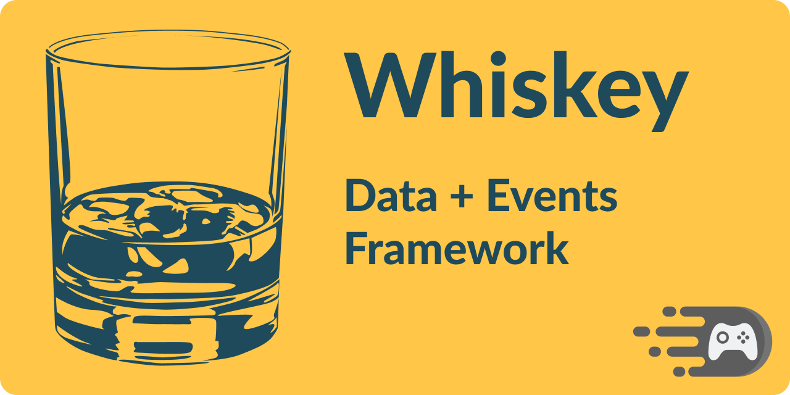

# Whiskey

Data and Events framework for Unity. 🥃⚡




[](https://openupm.com/packages/com.faster-games.whiskey/)
[](https://github.com/faster-games/whiskey/actions/workflows/main.yml)
[](https://discord.gg/QfQE6rWQqq)

Whiskey is a framework for managing data and events within [Unity](https://unity3d.com). It leans heavily on [ScriptableObject](https://docs.unity3d.com/Manual/class-ScriptableObject.html), and is inspired by [Ryan Hipple's Unite 2017 Talk](https://www.youtube.com/watch?v=raQ3iHhE_Kk). Whiskey lets game designers own and edit data definitions while programmers continue to evolve code - Whiskey brings the two together with references, to reduce merge conflicts.

Goals:

- Create, Edit, and Visualize data within the Editor, not code.
- Encourage decoupling, by using asset references rather than singletons.
- Quickly swap between data constants and references without rewriting code.

Features:

- Boxed data, stored as assets on disk using [ScriptableObject](https://docs.unity3d.com/Manual/class-ScriptableObject.html).
- Weighted loot tables, for easy to manage [probability based loot drops](https://lostgarden.home.blog/2014/12/08/loot-drop-tables/).
- Events, stored as assets on disk using [ScriptableObject](https://docs.unity3d.com/Manual/class-ScriptableObject.html).
- Event Listeners, for binding to Events using [MonoBehaviours](https://docs.unity3d.com/Manual/class-MonoBehaviour.html).
- References, for consuming data in code indirectly.

## Installing

This package supports [openupm](https://openupm.com/packages/com.faster-games.whiskey/) - you can install it using the following command:

```
openupm add com.faster-games.whiskey
```

Or by adding directly to your `manifest.json`:

> Note: You may also use specific versions by appending `#{version}` where version is a [Release tag](https://github.com/faster-games/whiskey/releases) - e.g. `#v1.2.0`.

```
dependencies: {
	...
	"com.faster-games.whiskey": "git+https://github.com/faster-games/whiskey.git"
}
```

Or by using [Package Manager](https://docs.unity3d.com/Manual/upm-ui-giturl.html) to "Add a package from Git URL", using the following url:

```
https://github.com/faster-games/whiskey.git
```

## Documentation

<center>

[Manual 📖](https://whiskey.faster-games.com/manual/getting-started.html) | [Scripting API 🔎](https://whiskey.faster-games.com/ref/FasterGames.Whiskey.html)

</center>


### Quickstart

> Disclaimer: By nature, Whiskey isn't easy to demonstrate. As such, this may not be as "quick" as you'd expect! 😅

- Right click in the [Project Window](https://docs.unity3d.com/Manual/ProjectView.html) select: `Create, Whiskey, Boxes, Int`
- Name the created data instance
- Select the data instance
- Edit the data in the [Inspector Window](https://docs.unity3d.com/Manual/UsingTheInspector.html)
- Right click in the [Project Window](https://docs.unity3d.com/Manual/ProjectView.html) select: `Create, C# Script`
- Name the created script `IntTestBehaviour`
- Edit the script, adding the following:
```cs
using FasterGames.Whiskey.Boxes;
using UnityEngine;

public class IntTestBehaviour : MonoBehaviour
{
    public Ref<int> intRef;

    private void Start()
    {
        Debug.Log(intRef.Value);
    }
}
```
- Right click in the [Hierarchy Window](https://docs.unity3d.com/Manual/Hierarchy.html) select: `Create Empty`
- Name the created object
- Select the object in the [Hierarchy Window](https://docs.unity3d.com/Manual/Hierarchy.html), then in the [Inspector Window](https://docs.unity3d.com/Manual/UsingTheInspector.html) select `Add Component` and search for `IntTestBehaviour`, selecting the first result (which should be the script you created above)
- Note the `Int Ref` field is displayed, by default it is a `Direct` reference. A direct reference is effectively a hard coded value.
- Select the `Direct` dropdown, and change it to `Boxed`. Note the field changes, allowing you to drag and drop an object reference, and showing an additional dropdown field.
- Ensure the additional dropdown field is set to `BoxedInt`, which will allow the editor to more accurately assist you in selecting the object.
- Click the object reference field, and select the data instance you created above.
- You have now made your first data reference using Whiskey. Run the code, and note that the value stored in your data instance is logged by the `IntTestBehaviour` script on `Start`.

🚀🚀🚀 Thanks for bearing with us! There's a lot of features in Whiskey, this quickstart only demonstrates one. To learn more, see [The manual](https://whiskey.faster-games.com/manual/getting-started.html).

## Supporting the project

If this project saved you some time, and you'd like to see it continue to be invested in, consider [buying me a coffee. ☕](https://www.buymeacoffee.com/bengreenier) I do this full-time, and every little bit helps! 💙
